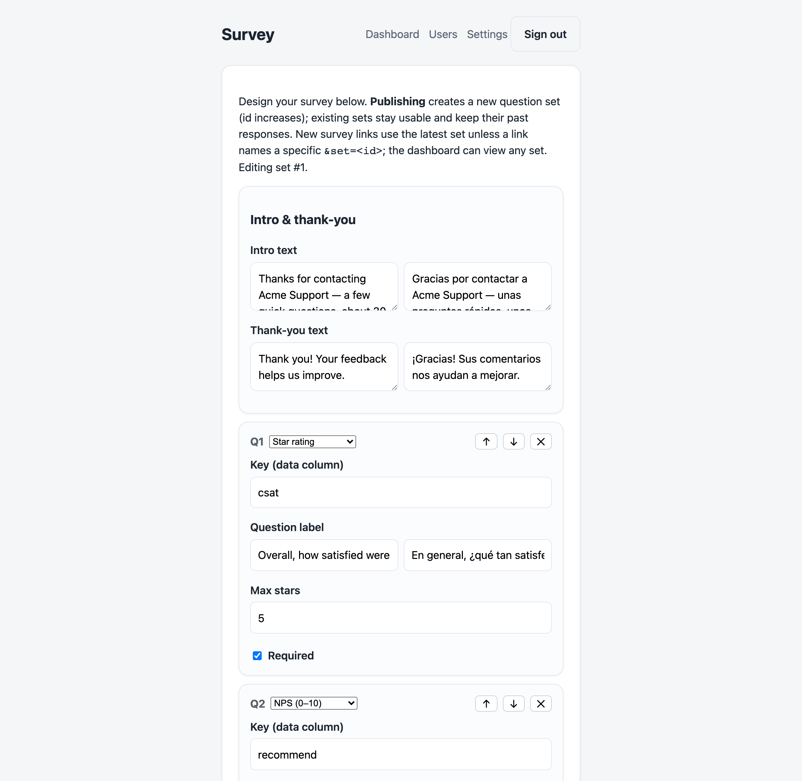
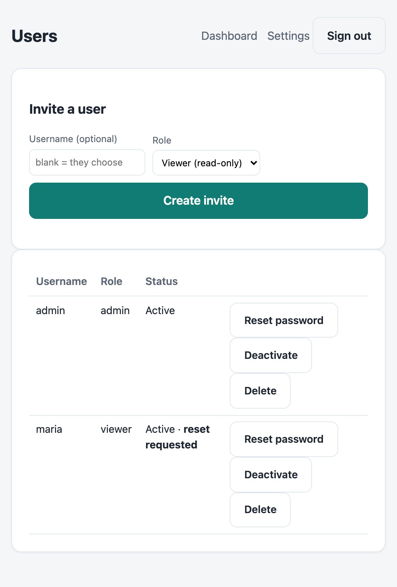

# CSAT

[](https://github.com/ronpinkas/csat/actions/workflows/ci.yml)
[](LICENSE)

A self-contained, **configurable** survey + analytics app in a single Go binary. Runs single-tenant
out of the box, or **optionally multi-tenant** — one flag turns it into a platform that serves many
customers from one host, each isolated in its own database. Ships a CSAT instrument by default;
design your own questions right in the admin UI.

- **Public survey** reached via a tokenized link (an SMS after a support call, an email after an
  order): **stars, scales, NPS, single/multi-choice, free text**, each with per-language labels.
- **Visual Survey Designer** — build and edit questions in the browser (no JSON, no restart). Each
  edit publishes a new versioned **question set**, and every response stays tied to the set it was
  answered with, so analytics never mix instruments.
- **Admin dashboard** that **auto-adapts to your questions**: per-question KPIs, distributions, NPS,
  breakdowns, daily trend, recent comments, and CSV export — over a selectable date range *and*
  question set.
- **Per-tenant branding** — name, accent color, and logo, editable in Settings (applied to the
  survey and admin UI alike).
- **Optionally multi-tenant** — `[tenancy] mode = "multi"` gives each tenant ("ref") its own
  database; the platform onboards customers self-serve via a signed `/provision` call that returns
  an admin invite link (no shared password). Single-tenant deployments are byte-for-byte unchanged.
- **One binary.** SQLite (pure-Go), all HTML/CSS/JS + Chart.js embedded. No runtime, no
  `node_modules`. Cross-compiles to a static Linux binary from any OS.

## Screenshots

Admin dashboard — **auto-adapts to your questions**: per-question KPIs, NPS, distributions,
choice/multichoice breakdowns, daily trend, and recent comments, over a selectable date range:


The **visual Survey Designer** — add / reorder / delete question cards, pick a type (stars, scale,
NPS, single/multi choice, free text), set per-language labels and options, all in the browser.
Publishing versions it as a new question set — no JSON, no restart:



Built-in **user management** — invite admins or read-only viewers by link, issue a single-use
password-reset link, deactivate, or delete any account. Self-service reset requests surface here
as a badge so an admin can act on them:



The customer survey (here the rich `survey.example.json` — stars, NPS, choice, multichoice,
scale, text), localized by the link's language token, with a per-deployment logo + theme:

| English | Español |
|:---:|:---:|
|  |  |

## Install (one line)

On a Linux server:

```sh
curl -fsSL https://raw.githubusercontent.com/ronpinkas/csat/main/install.sh | sudo sh
```

It detects your OS/arch, downloads the matching release, **verifies its SHA-256**, and installs the
binary + a `systemd` service. It also installs an updater (`csat-update`) you can run anytime; the
nightly **auto-update timer is off by default** — opt in with `CSAT_AUTOUPDATE=1`. Pin a version
with `CSAT_VERSION=v1.0.0`. macOS installs just the binary (no service); Windows users download the
zip from [Releases](https://github.com/ronpinkas/csat/releases).

> Prefer to read first? `curl -fsSL .../install.sh -o install.sh`, inspect it, then `sudo sh install.sh`.

After install: edit `/etc/csat/config.toml`, drop a `logo.*` into `/etc/csat/`, set the admin
password in `/etc/csat/csat.env`, `sudo systemctl enable --now csat`, then front it with TLS (see
`deploy/`). The token secret to share with your link-builder is shown on the admin **Settings** page.

### Updating

Update on demand with `sudo csat-update` — it fetches the latest release within the current major
line, backs up the database, verifies the checksum, swaps the binary, and restarts. Config, secret,
logo, and data are untouched. To automate it nightly (opt-in), enable the timer:
`sudo systemctl enable --now csat-update.timer`. A new major (e.g. `v2`) is always left for you to
apply deliberately.

## Build

```sh
make build          # local binary -> dist/csat
make build-linux    # static linux/amd64 -> dist/csat-linux-amd64 (CGO disabled)
make package        # release tarball -> dist/csat-<version>-linux-amd64.tar.gz
make test           # run the test suite
```

The Linux binary is a single statically-linked file (everything embedded, no runtime). `make
package` bundles it with config templates, the systemd unit, and an installer — see
[`INSTALL.md`](INSTALL.md).

**Prebuilt downloads:** each tagged release attaches archives for **Linux, macOS, and Windows
(amd64 + arm64)** — see the [Releases](https://github.com/ronpinkas/csat/releases) page. Tag a
version (`git tag v1.0.0 && git push --tags`) and the release workflow builds and publishes them.

## Run (local)

```sh
cp config.example.toml config.toml      # edit site name, db path, etc.
cp .env.example .env                     # leave CSAT_CRYPTO_SECRET unset to auto-generate
dist/csat -config config.toml
```

On first boot it creates the SQLite DB, runs migrations, seeds the `admin` user (password from
`CSAT_ADMIN_INITIAL_PW`, force-changed on first login), and — if no `crypto_secret` is set —
generates a unique token secret and prints it (also visible at `/settings`).

Mint a test link without the call platform:

```sh
dist/csat -config config.toml -mint -subject "+15551234567" -ts 1717286400 -base "http://localhost:8080"
```

## The token contract (for the call platform's link-builder)

The SMS link is `https://<host>/s?t=<token>`. The platform builds `<token>`; this app only
validates it. The token **encrypts** the caller id and call time (nothing sensitive appears in
the URL) and is self-authenticating.

```
key   = SHA-256(crypto_secret)                                       // 32 bytes
pt    = subject + "|" + subjectTimeUnixSeconds + "|" + lang [+ "|" + ref]  // fields may not contain "|"
nonce = 12 random bytes
ct    = AES-256-GCM_Seal(key, nonce, pt)                             // no associated data
token = base64url_nounpad( nonce || ct )                            // ct includes the 16-byte tag
```

`subject` is whatever the survey is about — a phone number, order id, ticket id, … `lang` is the
survey language: `en` or `es` (anything else falls back to `en`). The optional 4th field `ref`
binds the token to a tenant in **multi-tenant mode** (below); omit it for single-tenant
deployments and existing links keep working byte-for-byte. The `crypto_secret` is the
per-deployment value shown on the admin **Settings** page; use the same value on both sides.
There is **no expiry**; each link is **single-use** (a second submit for the same subject+time is
rejected). Ready-made link builders are in [`integrations/`](integrations/) (Python + Node).

Generate a test link:

```sh
dist/csat -config config.toml -mint -subject "+15551234567" -ts 1717286400 -lang es -base "http://localhost:8080"
```

## Multi-tenant mode

CSAT runs single-tenant by default — one database, no `ref` anywhere — exactly as it always has.
Set `[tenancy] mode = "multi"` to serve **many customers from one fixed host** (e.g. the shared
`csat.example.com` appliance). Each tenant ("ref" — typically the customer's domain) gets its own
SQLite database under `data_dir`, created and migrated on first use. Tenants are isolated by the
file boundary: separate users, sessions, invites, and responses, with **no shared tables**.

```toml
[tenancy]
mode     = "multi"
data_dir = "/var/lib/csat/tenants"   # one <ref>.db per tenant
```

How the tenant travels with each request:

| Surface | How `ref` is carried |
| --- | --- |
| Survey link | Encoded **inside the token** (tamper-proof). Mint with `-ref`: `csat … -mint -subject … -ref acme.com` |
| Admin sign-in | `?ref=acme.com` on the `/login` link; the session cookie then pins the tenant for all later requests |

**Onboarding (and recovery) — `POST /provision`.** The platform (which shares the deployment's
crypto secret) mints a short-lived, signed provisioning token and POSTs it; CSAT creates/ensures
the tenant, seeds its question set + branding, and returns an **admin invite link** as JSON. No
shared password, no super-admin console — the shared secret *is* the authorization:

```
POST /provision?t=<token>
  -> { "ref":"acme.com", "invite_url":".../invite?t=…&ref=acme.com" }
```

The call is **repeatable**, which doubles as forgot-password recovery: the customer opens the
invite and enters their email + a password. A new email creates the admin; an **email that already
exists reclaims that account** (the invite acts as a password reset). So a sole admin who lost
their password is recovered by simply re-provisioning — no other admin needed. (This reclaim
behavior is limited to platform-minted invites; a normal admin-issued invite never overrides an
existing account.)

The token is built like a survey token (subject `__provision__`, tenant in `ref`, `subjectTime` =
the not-after expiry): use `csat -mint-tenant -ref acme.com -base …`, or the `provisionUrl` /
`provision_url` helpers in [`integrations/`](integrations/). Hand the returned `invite_url` to the
customer. (Onboarding needs no DNS, no certificate, no restart.)

> **The crypto secret is a deployment-wide master key.** It signs survey links *and* provisioning
> tokens, so anyone holding it could forge links or provision/seize any tenant. In multi-tenant mode
> it is held only by the platform and **never shown to tenant admins** — the Settings page hides it
> (single-tenant operators, who own the deployment, still see it). One host-level secret, set once
> (env `CSAT_CRYPTO_SECRET` or the auto-generated keyfile); tenants self-serve and never touch it.

> Legacy fallback: when no platform integration is used, a tenant's admin is still seeded on first
> `/login?ref=` from `admin.username` / `CSAT_ADMIN_INITIAL_PW` — fine for testing, but prefer
> `/provision` in production so each tenant's first admin sets its own password.

Backward compatibility is by construction: a single-tenant deployment (like an existing on-prem
install) never sets the flag, never migrates, and is byte-for-byte unchanged. The two modes are
mutually exclusive per deployment.

## Survey definition (question sets)

The questions are data, not code, and they live in the **database** as versioned *question sets*,
edited in the admin **Survey** tab — no filesystem access or restart needed. `[survey] definition`
is only a **seed**: on first run its `survey.json` (or the built-in default) becomes set #1 and any
pre-existing responses are backfilled to it. After that the database is the source of truth; once
ported, the seed file is renamed to `survey.json.ported` (single-tenant, best-effort) and may be
removed — a missing seed file is not an error.

**Versioning, names & default.** Editing publishes a *new* set (id increases); older sets are never
mutated, stay mintable, and keep their responses. Sets can be **named**, and one can be **pinned as
the default** (the "Set as default" box when publishing) — blank links and the dashboard then use it
instead of the implicit newest set. Each response records the set it was answered under, so
analytics are always coherent:

- **Survey links** use the pinned default set (or the newest if none is pinned), or name one
  explicitly: `/s?t=<token>&set=<id>` (mint with `--set`, or just append `&set=`).
- **Dashboard** shows a *Question set* selector (default = the pinned/newest set); analytics and CSV
  are scoped to the selected set.

Each question has a `key`, a `type`, per-language `label`s, and `required`:

| type | renders as | stored | dashboard |
|---|---|---|---|
| `stars` | 1–`max` stars | number | average + top-box % + distribution |
| `scale` | `min`–`max` buttons (+ end labels) | number | average + distribution |
| `nps` | 0–10 buttons | number | **NPS score** + distribution |
| `choice` | radios | value | breakdown donut |
| `multichoice` | checkboxes | values | breakdown donut |
| `text` | textarea | text | recent comments |

```json
{
  "version": 1,
  "intro":  { "en": "Thanks for your call. How did we do?", "es": "Gracias por su llamada. ¿Cómo lo hicimos?" },
  "thanks": { "en": "Thank you!", "es": "¡Gracias!" },
  "questions": [
    { "key": "recommend", "type": "nps", "required": true,
      "label": { "en": "How likely are you to recommend us?" },
      "ends":  { "low": { "en": "Not likely" }, "high": { "en": "Very likely" } } },
    { "key": "topics", "type": "multichoice", "label": { "en": "What did we discuss?" },
      "options": [ {"value":"billing","label":{"en":"Billing"}}, {"value":"tech","label":{"en":"Technical"}} ] }
  ]
}
```

See [`survey.example.json`](survey.example.json) for the full default. System strings (buttons,
errors, "thank you") come from the built-in `en`/`es` catalog; question wording lives in the
survey.json. Add a language by adding its key to each label map.

## Branding

Per-deployment branding lives in `[branding]` (see `config.example.toml`):

- **Logo** — just drop a file named `logo.svg` / `logo.png` / `logo.webp` / `logo.jpg`
  (also `.jpeg/.gif/.bmp`) next to `config.toml`. It's auto-detected and served at
  `/branding/logo`, resolved per request — adding, replacing, or removing it takes effect with
  no restart. (`logo_dir` changes where to look; `logo_path` sets an explicit override.)
- **Theme color** — `theme_color` (hex) drives buttons and selected states, served via
  `/branding/theme.css` so the strict no-inline-styles CSP still holds.

These show on the survey, done/error, and login pages.

## Deploy

See [`deploy/README.md`](deploy/README.md) for the systemd + reverse-proxy setup. In short:
drop the binary at `/usr/local/bin/csat`, config at `/etc/csat/config.toml`, secrets at
`/etc/csat/csat.env` (both `chmod 600`), enable the `csat.service` unit, and point your reverse
proxy at the listen address (or set `server.tls.mode = "autocert"` to terminate TLS in-process).

## Layout

```
cmd/csat            entrypoint (config, wiring, graceful shutdown, -mint helper)
internal/config     TOML + .env loader, env: indirection, secret resolution
internal/db         SQLite open (WAL) + embedded migrations
internal/token      AES-256-GCM survey-link tokens
internal/surveydef  survey.json schema (types, i18n) + embedded default
internal/survey     dynamic form rendering + one-time submission
internal/admin      auth, sessions, invites, analytics, settings, CSV export
internal/httpx      server, security headers/CSP, rate limiting, logging
internal/web        embedded templates + static assets (incl. vendored Chart.js)
```

## Security model

There is nothing secret in this repository. Each deployment's safety rests on its own
`crypto_secret` (auto-generated per deployment, never committed) — the link tokens are AES-256-GCM
sealed with `SHA-256(crypto_secret)`. Publishing the source does not weaken any deployment; rotate
the secret if it is ever exposed. Report security issues privately to the maintainer rather than via
public issues.

## License

MIT — see [LICENSE](LICENSE). Bundles Chart.js (MIT).
