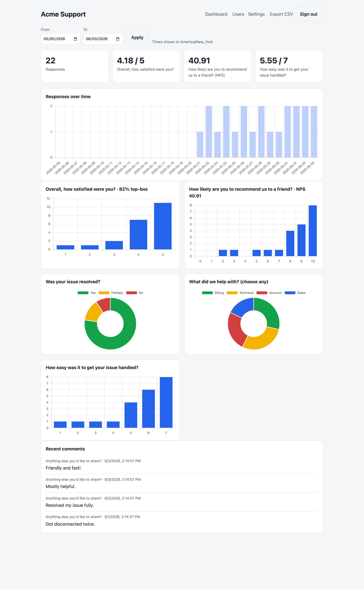
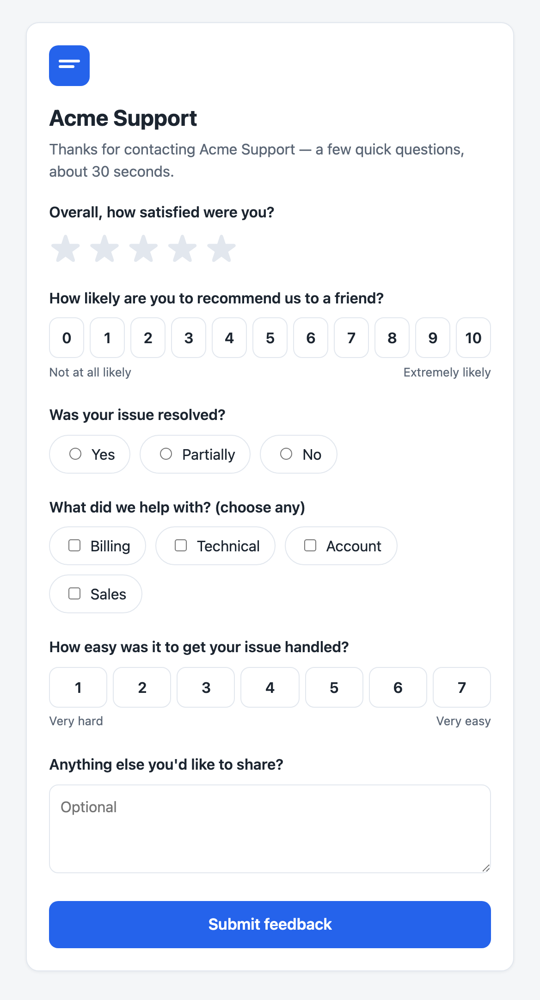
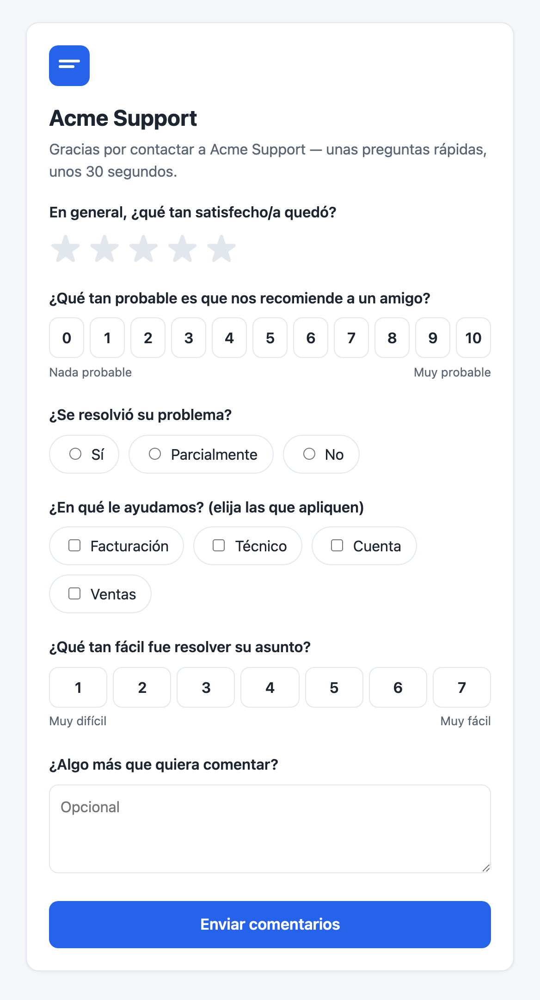

# CSAT

[](https://github.com/ronpinkas/csat/actions/workflows/ci.yml)
[](LICENSE)

A self-contained, **configurable** survey + analytics app in a single Go binary. Ships a CSAT
instrument by default; define your own questions in a `survey.json`.

- **Public survey** reached via a tokenized link (e.g. an SMS after a support call, an email
  after an order). The questions are defined in `survey.json` — **stars, scales, NPS,
  single/multi-choice, free text** — each with per-language labels.
- **Admin dashboard** (authenticated) that **auto-adapts to your questions**: per-question KPIs,
  distributions, NPS, breakdowns, daily trend, recent comments, and CSV export — all over a
  selectable date range.
- **One binary.** SQLite (pure-Go), all HTML/CSS/JS + Chart.js embedded. No runtime, no
  `node_modules`. Cross-compiles to a static Linux binary from any OS.

## Screenshots

Admin dashboard — **auto-adapts to your questions**: per-question KPIs, NPS, distributions,
choice/multichoice breakdowns, daily trend, and recent comments, over a selectable date range:



The customer survey (here the rich `survey.example.json` — stars, NPS, choice, multichoice,
scale, text), localized by the link's language token, with a per-deployment logo + theme:

| English | Español |
|:---:|:---:|
|  |  |

## Build

```sh
make build          # local binary -> dist/csat
make build-linux    # static linux/amd64 -> dist/csat-linux-amd64 (CGO disabled)
make package        # release tarball -> dist/csat-<version>-linux-amd64.tar.gz
make test           # run the test suite
```

The Linux binary is a single statically-linked file (everything embedded, no runtime). `make
package` bundles it with config templates, the systemd unit, and an installer — see
[`INSTALL.md`](INSTALL.md).

**Prebuilt downloads:** each tagged release attaches archives for **Linux, macOS, and Windows
(amd64 + arm64)** — see the [Releases](https://github.com/ronpinkas/csat/releases) page. Tag a
version (`git tag v1.0.0 && git push --tags`) and the release workflow builds and publishes them.

## Run (local)

```sh
cp config.example.toml config.toml      # edit site name, db path, etc.
cp .env.example .env                     # leave CSAT_CRYPTO_SECRET unset to auto-generate
dist/csat -config config.toml
```

On first boot it creates the SQLite DB, runs migrations, seeds the `admin` user (password from
`CSAT_ADMIN_INITIAL_PW`, force-changed on first login), and — if no `crypto_secret` is set —
generates a unique token secret and prints it (also visible at `/settings`).

Mint a test link without the call platform:

```sh
dist/csat -config config.toml -mint -subject "+15551234567" -ts 1717286400 -base "http://localhost:8080"
```

## The token contract (for the call platform's link-builder)

The SMS link is `https://<host>/s?t=<token>`. The platform builds `<token>`; this app only
validates it. The token **encrypts** the caller id and call time (nothing sensitive appears in
the URL) and is self-authenticating.

```
key   = SHA-256(crypto_secret)                            // 32 bytes
pt    = subject + "|" + subjectTimeUnixSeconds + "|" + lang  // none of the fields may contain "|"
nonce = 12 random bytes
ct    = AES-256-GCM_Seal(key, nonce, pt)                  // no associated data
token = base64url_nounpad( nonce || ct )                  // ct includes the 16-byte tag
```

`subject` is whatever the survey is about — a phone number, order id, ticket id, … `lang` is the
survey language: `en` or `es` (anything else falls back to `en`). The `crypto_secret` is the
per-deployment value shown on the admin **Settings** page; use the same value on both sides.
There is **no expiry**; each link is **single-use** (a second submit for the same subject+time is
rejected). Ready-made link builders are in [`integrations/`](integrations/) (Python + Node).

Generate a test link:

```sh
dist/csat -config config.toml -mint -subject "+15551234567" -ts 1717286400 -lang es -base "http://localhost:8080"
```

## Survey definition (`survey.json`)

The questions are data, not code. Point `[survey] definition` at a `survey.json` (or use the
built-in default). Each question has a `key`, a `type`, per-language `label`s, and `required`:

| type | renders as | stored | dashboard |
|---|---|---|---|
| `stars` | 1–`max` stars | number | average + top-box % + distribution |
| `scale` | `min`–`max` buttons (+ end labels) | number | average + distribution |
| `nps` | 0–10 buttons | number | **NPS score** + distribution |
| `choice` | radios | value | breakdown donut |
| `multichoice` | checkboxes | values | breakdown donut |
| `text` | textarea | text | recent comments |

```json
{
  "version": 1,
  "intro":  { "en": "Thanks for your call. How did we do?", "es": "Gracias por su llamada. ¿Cómo lo hicimos?" },
  "thanks": { "en": "Thank you!", "es": "¡Gracias!" },
  "questions": [
    { "key": "recommend", "type": "nps", "required": true,
      "label": { "en": "How likely are you to recommend us?" },
      "ends":  { "low": { "en": "Not likely" }, "high": { "en": "Very likely" } } },
    { "key": "topics", "type": "multichoice", "label": { "en": "What did we discuss?" },
      "options": [ {"value":"billing","label":{"en":"Billing"}}, {"value":"tech","label":{"en":"Technical"}} ] }
  ]
}
```

See [`survey.example.json`](survey.example.json) for the full default. System strings (buttons,
errors, "thank you") come from the built-in `en`/`es` catalog; question wording lives in the
survey.json. Add a language by adding its key to each label map.

## Branding

Per-deployment branding lives in `[branding]` (see `config.example.toml`):

- **Logo** — just drop a file named `logo.svg` / `logo.png` / `logo.webp` / `logo.jpg`
  (also `.jpeg/.gif/.bmp`) next to `config.toml`. It's auto-detected and served at
  `/branding/logo`, resolved per request — adding, replacing, or removing it takes effect with
  no restart. (`logo_dir` changes where to look; `logo_path` sets an explicit override.)
- **Theme color** — `theme_color` (hex) drives buttons and selected states, served via
  `/branding/theme.css` so the strict no-inline-styles CSP still holds.

These show on the survey, done/error, and login pages.

## Deploy

See [`deploy/README.md`](deploy/README.md) for the systemd + reverse-proxy setup. In short:
drop the binary at `/usr/local/bin/csat`, config at `/etc/csat/config.toml`, secrets at
`/etc/csat/csat.env` (both `chmod 600`), enable the `csat.service` unit, and point your reverse
proxy at the listen address (or set `server.tls.mode = "autocert"` to terminate TLS in-process).

## Layout

```
cmd/csat            entrypoint (config, wiring, graceful shutdown, -mint helper)
internal/config     TOML + .env loader, env: indirection, secret resolution
internal/db         SQLite open (WAL) + embedded migrations
internal/token      AES-256-GCM survey-link tokens
internal/surveydef  survey.json schema (types, i18n) + embedded default
internal/survey     dynamic form rendering + one-time submission
internal/admin      auth, sessions, invites, analytics, settings, CSV export
internal/httpx      server, security headers/CSP, rate limiting, logging
internal/web        embedded templates + static assets (incl. vendored Chart.js)
```

## Security model

There is nothing secret in this repository. Each deployment's safety rests on its own
`crypto_secret` (auto-generated per deployment, never committed) — the link tokens are AES-256-GCM
sealed with `SHA-256(crypto_secret)`. Publishing the source does not weaken any deployment; rotate
the secret if it is ever exposed. Report security issues privately to the maintainer rather than via
public issues.

## License

MIT — see [LICENSE](LICENSE). Bundles Chart.js (MIT).
